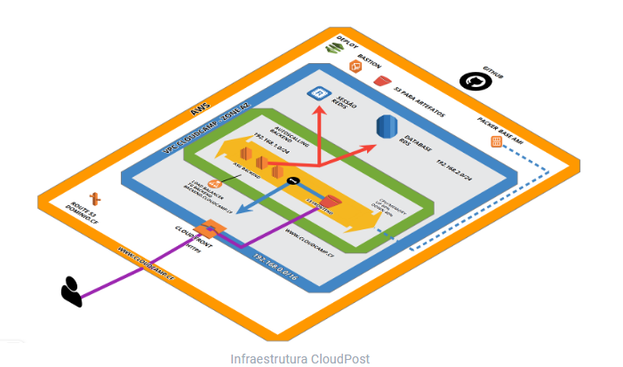

# INTRODUÇÃO

Repositório Cloud Post:  
[https://github.com/treinacloud](https://github.com/treinacloud)  
  
AWS Free Tier:  
[https://aws.amazon.com/pt/free](https://aws.amazon.com/free/)

Domínio Gratuito:  
[https://www.freenom.com/pt/index.html](https://www.freenom.com/pt/index.html)  
  
Distribuição utilizada:  
Linux MX  
[https://ftp.cica.es/mirrors/Linux/MX-ISOs/MX/Final/MX-18.3\_x64.iso](https://ftp.cica.es/mirrors/Linux/MX-ISOs/MX/Final/MX-18.3_x64.iso)  
  
Link da Arquitetura:  
[https://cloudcraft.co/view/1ef2451c-e37e-41b0-a051-bc27d9058610?key=HwsLxgwkcQrVFBSnt9FceA](https://cloudcraft.co/view/1ef2451c-e37e-41b0-a051-bc27d9058610?key=HwsLxgwkcQrVFBSnt9FceA)

